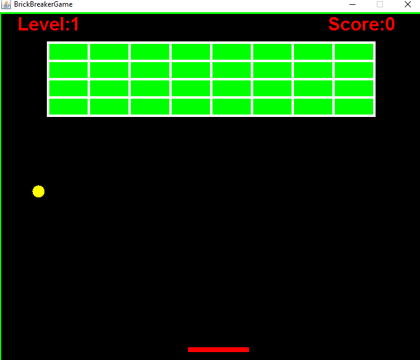
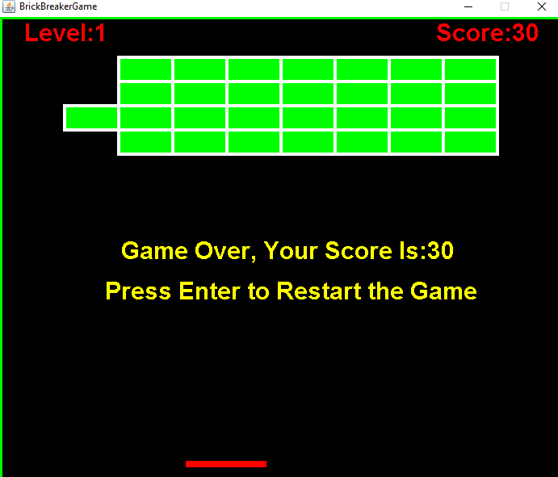

# BrickBreakerGame
BrickBreakerGame In Java Using OOAD Design Pattern

## Design Pattern
I have use **Singleton** design pattern in this game.

Singleton pattern is one of the simplest design patterns in Java. This type of design pattern comes under creational pattern as this pattern provides one of the best ways to create an object.

This pattern involves a single class which is responsible to create an object while making sure that only single object gets created. This class provides a way to access its only object which can be accessed directly without need to instantiate the object of the class.
## How To Play
Use **spacebar** to play the game.
## ScreenShots

